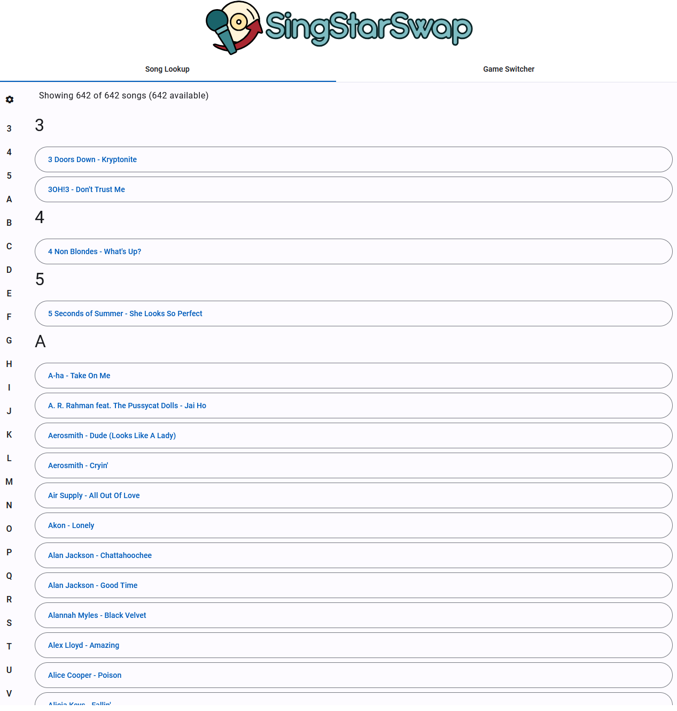
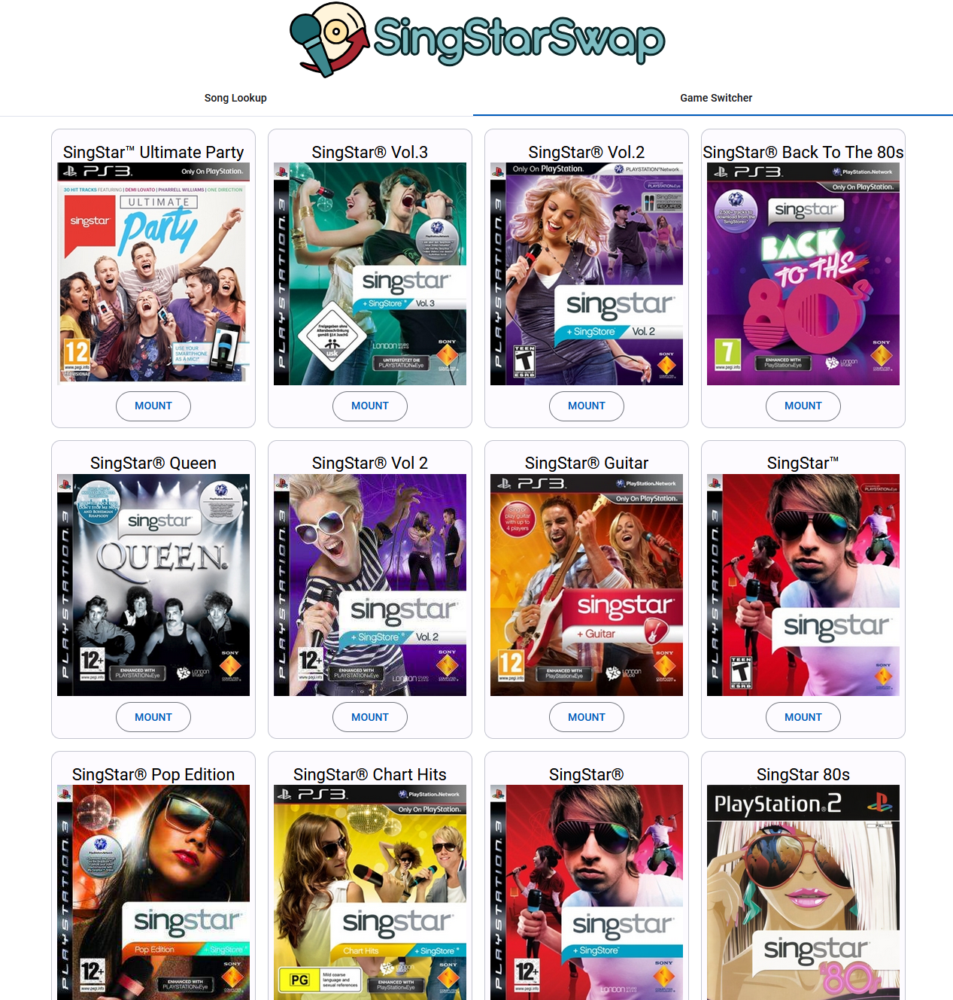

# SingStarSwap

A web-based application for browsing and mounting/swapping SingStar games on your PlayStation 3 with webMAN MOD.

Browse your PS2 and PS3 SingStar collection, browse songs in available games, and mount games directly from your browser.

## Features

- 🎮 Browse PS2 and PS3 SingStar games on your PS3
- 🎵 View song lists and game information
- 🖼️ Display game cover artwork
- 🎯 Mount (Swap discs) remotely
- 📱 Mobile-friendly interface - control from any device on your network
- ⚙️ Web-based configuration interface
- 🐳 Docker support for easy deployment

## Screenshots

### Song Lookup View
Browse and search through songs across all your SingStar games:



### Game Switcher View
Quick access to mount any game from your collection:




## Table of Contents

- [Prerequisites](#prerequisites)
- [Installation](#installation)
  - [Option 1: Using Pre-built Releases](#option-1-using-pre-built-releases)
  - [Option 2: Using Docker](#option-2-using-docker)
  - [Option 3: Building from Source](#option-3-building-from-source)
- [PS3 Setup](#ps3-setup)
- [Usage](#usage)
- [Advanced Configuration](#advanced-configuration)
- [Troubleshooting](#troubleshooting)
- [Known Issues](#known-issues)
- [Development](#development)
- [License](#license)

## Prerequisites

### PS3 Requirements

Your PlayStation 3 must have:

**webMAN MOD** installed and running
- HTTP server must be enabled (default port 80)
- Available from [webMAN MOD releases](https://github.com/aldostools/webMAN-MOD)
- See [PS3 Setup](#ps3-setup) for configuration

### Network Requirements

- PS3 and your computer must be on the **same local network**
- No additional firewall configuration required (uses standard HTTP)

### Game Storage

Your SingStar games should be stored on the PS3:

- **PS2 SingStar games**: Folder-based format (not ISOs)
  - Default location: `/dev_hdd0/SINGSTAR/`
  - Each game in its own folder
  - These games will not show up in webMAN MOD - however this is the way to mount PS2 games (combined with a PS2 ISO)
  
- **PS3 SingStar games**: ISO or folder format
  - Default location: `/net0/PS3ISO/`
  - Must be visible in webMAN MOD's game list

**Note**: Game paths are configurable and these are just defaults. You can point to wherever your games are actually stored.

## Installation

### Option 1: Using Pre-built Releases

1. Download the latest release for your operating system from the [Releases page](https://github.com/SamEvansTurner/SingStarSwap/releases)
2. Extract the archive
3. Run the executable:
   - **Windows**: `SingStarSwap.exe`
   - **Linux/macOS**: `./SingStarSwap`
4. Open your browser to `http://localhost:4000`

### Option 2: Using Docker

Pull and run the Docker image:

```bash
docker run -d \
  -p 4000:4000 \
  -v singstarswap-config:/root/.config/SingStarSwap \
  --name singstarswap \
  ghcr.io/samevanturner/singstarswap:latest
```

Then access the application at `http://localhost:4000`

**Docker Compose example:**

```yaml
version: '3'
services:
  singstarswap:
    image: ghcr.io/samevanturner/singstarswap:latest
    container_name: singstarswap
    ports:
      - "4000:4000"
    volumes:
      - singstarswap-config:/root/.config/SingStarSwap
    restart: unless-stopped

volumes:
  singstarswap-config:
```

### Option 3: Building from Source

#### Prerequisites

- Go v1.22.6 or higher
- Node.js 20.16.0 or higher
- Angular CLI 18.1.4 or higher
- Taskfile v3.37.2 or higher
- Goreleaser v2.1.0 or higher (for releases)
- Unix tools (rm, etc.) - Available via Git for Windows on Windows

#### Build Steps

1. Clone the repository:
```bash
git clone https://github.com/SamEvansTurner/SingStarSwap.git
cd SingStarSwap
```

2. Build the application:
```bash
task build
```

3. Run the application:
```bash
task run
```

The application will be available at `http://localhost:4000`

#### Development Commands

- `task build` - Build the complete application (webapp + backend)
- `task run` - Run the application in development mode
- `task clean` - Clean build artifacts

## PS3 Setup (Once-Off)

**Note**: This section assumes you already have webMAN MOD installed and configured on your PS3. For installation guides, please refer to PS3 modding communities and the [webMAN MOD repository](https://github.com/aldostools/webMAN-MOD).

### 1. Configure PS2 ISO Support

webMAN MOD requires at least one PS2 ISO to enable PS2 game mounting:

1. Place at least one valid PS2 game ISO on your PS3
   - Recommended location: `/dev_hdd0/PS2ISO/`
   - Any PS2 game will work as a "loader"
2. This ISO allows the PS2 emulator to initialize for folder-based PS2 games

### 2. Organize Your SingStar Games

**PS2 SingStar Games:**
- Store games in **folder format** (not ISOs)
- Default location: `/dev_hdd0/SINGSTAR/`
- Each game should be in its own folder
- Folder names should contain "SingStar" for automatic detection

**PS3 SingStar Games:**
- Store as ISO files or folder games
- Default location: `/net0/PS3ISO/`
- Games must appear in webMAN MOD's game list
- Game titles should contain "SingStar" for automatic detection

### 3. Find Your PS3's IP Address

1. On your PS3, navigate to **Settings** → **Network Settings** → **Settings and Connection Status List**
2. Note the **IP Address** (e.g., `192.168.1.100`)
3. You'll need this for SingStarSwap configuration

## Usage

### First-Time Setup

1. **Start SingStarSwap**
   - Run the executable, Docker container, or use `task run`
   - The server will start on port 4000 (or your configured port)

2. **Access the web interface**
   - Open your browser to `http://localhost:4000`
   - You should see the SingStarSwap interface

3. **Configure PS3 connection**
   - Click the settings icon (⚙️) in the application
   - Enter your PS3's IP address (e.g., `192.168.1.100`)
   - Adjust game paths if different from defaults
   - Click **Save**
   - See [Advanced Configuration](#advanced-configuration) for detailed settings

4. **Verify your games**
   - Your PS2 and PS3 SingStar games should appear in the interface
   - If no games show up, check the [Troubleshooting](#troubleshooting) section

### Accessing from Mobile Devices

SingStarSwap's interface automatically adapts to mobile screens, allowing you to control your SingStar library from anywhere in your home.

**To access from your phone or tablet:**

1. **Find your PC's IP address** where SingStarSwap is running:
   - **Windows**: Open Command Prompt and run `ipconfig`, look for "IPv4 Address"
   - **Linux**: Run `ip addr show` or `hostname -I` in terminal
   - **macOS**: Run `ifconfig | grep "inet "` in terminal
   - **Docker**: Use the host machine's IP address

2. **Access from mobile device**:
   - Open your mobile browser
   - Navigate to `http://[PC_IP]:4000` (replace `[PC_IP]` with your computer's IP address)
   - Example: `http://192.168.1.50:4000`

3. **Requirements**:
   - Mobile device must be on the **same network** as the PC running SingStarSwap
   - You may need to configure firewall rules (see [Troubleshooting](#troubleshooting))

**Benefits of mobile access:**
- Mount games from your couch while sitting by your PS3
- Browse song lists without tying up your TV
- Quick game switching during parties

### Using SingStarSwap (Regular Workflow)

Once you've completed the first-time setup, follow these steps each time you want to play:

1. **Start SingStarSwap on your PC**
   - Ensure the application is running

2. **On your PS3: Launch a PS3 SingStar game**
   - Use **SingStar Ultimate Party** (2014) for best compatibility - this was the final PS3 SingStar release
   - Alternatively, use any PS3 SingStar game from 2009 onwards
   - These games have disc-loading functionality built-in

3. **On your PS3: Navigate to the "Change Disc" menu**
   - Access this from the game's main menu
   - The game will wait for a new disc to be inserted

4. **On your PC: Open the web interface**
   - Go to `http://localhost:4000` in your browser

5. **On your PC: Select and mount a game**
   - Browse or search for the SingStar game you want to play:
      - Find a song you want to sing and selecting it in the list, then selecting the 'Mount' button
      - Switch to the 'Game Switcher' tab and press the mount button on the card of the desired game
   - Wait a moment for the mounting process to complete

6. **On your PS3: Load the mounted game**
   - The PS3 SingStar game should detect the newly mounted disc
   - Start playing!

**Tips:**
- This disc-swapping method works for **both PS2 and PS3** SingStar games
- This method is most effective when using the disc-swap method within the SingStar game itself.
- Keep the base SingStar game running and just mount different games as needed
- Newer PS3 SingStar games (2009+) generally have the best disc-loading support

### Interface Features

- **Letter navigation** - Jump to songs/artists starting with specific letters
- **Artist Sort or Title Sort** - Sort by Artist Name, or Song Title
- **Song filters** - Filter by available games only (or disable to see all games)
- **Game covers** - View cover artwork for your games (if available from webMAN MOD/PS2 Covers database)

## Advanced Configuration

For most users, the basic configuration through the web interface (Settings icon ⚙️) is sufficient. This section provides additional details for advanced users who need to customize settings or manually edit configuration files.

### Configuration Settings

| Setting | Description | Default | Notes |
|---------|-------------|---------|-------|
| **PS3 Address** | Your PS3's IP address | `192.168.1.2` | Can include custom port (e.g., `192.168.1.100:8080` if webMAN MOD uses a non-standard port) |
| **PS2 Path** | Path to PS2 SingStar games on PS3 | `/dev_hdd0/SINGSTAR` | Must be accessible via webMAN MOD's HTTP interface |
| **PS3 Path** | Path to PS3 SingStar ISOs on PS3 | `/net0/PS3ISO` | Games must appear in webMAN MOD's game list |
| **Title Filter** | Text filter to identify SingStar games | `SingStar` | Case-insensitive matching |
| **Server Port** | Port for the web interface | `4000` | **Docker users**: See note below |

### Manual Configuration File Editing

Settings are stored in a JSON file at:

- **Windows**: `%LOCALAPPDATA%\SingStarSwap\settings.json`
- **Linux**: `~/.config/SingStarSwap/settings.json`
- **macOS**: `~/Library/Application Support/SingStarSwap/settings.json`
- **Docker**: `/root/.config/SingStarSwap/settings.json`

Example configuration:

```json
{
  "server": {
    "port": 4000
  },
  "PS3": {
    "address": "192.168.1.100",
    "ps2path": "/dev_hdd0/SINGSTAR",
    "titlefilter": "SingStar",
    "ps3path": "/net0/PS3ISO"
  }
}
```

After manually editing this file, restart SingStarSwap for changes to take effect.

### Docker Port Configuration

**Important for Docker users**: If you change the server port from the default `4000`, you must also update your Docker configuration:

**Docker run command:**
```bash
docker run -d \
  -p [NEW_PORT]:[NEW_PORT] \
  -v singstarswap-config:/root/.config/SingStarSwap \
  --name singstarswap \
  ghcr.io/samevanturner/singstarswap:latest
```

**Docker Compose:**
```yaml
services:
  singstarswap:
    ports:
      - "[NEW_PORT]:[NEW_PORT]"
```

For example, to use port `8080`:
- Update the config file or web UI to set `"port": 8080`
- Update Docker port mapping to `-p 8080:8080`
- Restart the container

### Automatic Server Restart

When you change the server port through the web interface, the application will automatically restart. However, this only affects the internal server - Docker port mappings must be updated manually by recreating the container.

## Troubleshooting

### Can't connect to PS3

**Problem**: Application can't reach your PS3

**Solutions**:
- Verify your PS3's IP address is correct
- Ensure PS3 and PC are on the same network
- Check that webMAN MOD's HTTP server is running
- Try accessing `http://[PS3_IP]/` in your browser directly
- If using a custom port on webMAN, include it in the address (e.g., `192.168.1.100:8080`)

### No games showing up

**Problem**: Games list is empty

**Solutions**:
- Check that your game paths are configured correctly
- Verify games are actually stored in those locations on your PS3
- Ensure folder/file names contain your title filter text (default: "SingStar")
- Check webMAN MOD can access those directories
- Try accessing the paths directly: `http://[PS3_IP]/dev_hdd0/SINGSTAR/`

### PS2 games won't mount

**Problem**: PS2 games fail to mount

**Solutions**:
- Ensure you have **at least one PS2 ISO** file on your PS3
- The PS2 ISO should be accessible to webMAN MOD
- Check `/dev_hdd0/PS2ISO/` or your configured PS2 ISO location
- PS2 games must be in **folder format**, not ISO format
- Verify webMAN MOD supports PS2 game mounting

### Can't access from mobile device

**Problem**: Mobile device can't connect to SingStarSwap

**Solutions**:
- Verify mobile device is on the **same network** as the PC running SingStarSwap
- Confirm you're using the correct PC IP address (not `localhost`)
- Try accessing from the PC first to verify the server is running
- **Check firewall settings** on the PC running SingStarSwap:
  - **Windows**: 
    - Open Windows Defender Firewall → Advanced Settings
    - Create new Inbound Rule for port 4000 (or your configured port)
    - Allow TCP connections
    - Or run: `netsh advfirewall firewall add rule name="SingStarSwap" dir=in action=allow protocol=TCP localport=4000`
  - **Linux (ufw)**:
    - Run: `sudo ufw allow 4000/tcp`
    - Run: `sudo ufw reload`
  - **Linux (iptables)**:
    - Run: `sudo iptables -A INPUT -p tcp --dport 4000 -j ACCEPT`
    - Save rules: `sudo iptables-save`
  - **macOS**:
    - System Preferences → Security & Privacy → Firewall
    - Firewall Options → Add SingStarSwap application
    - Or temporarily disable firewall for testing
- Test connectivity: Try pinging the PC from mobile device
- Some routers may block device-to-device communication - check router settings for "AP Isolation" or "Client Isolation" and disable if enabled

### Application won't start

**Problem**: SingStarSwap executable doesn't run

**Solutions**:
- Check the port (4000) isn't already in use
- Try changing the port in the config file
- Check file permissions (Linux/macOS: `chmod +x SingStarSwap`)
- Review console output for error messages

## Development

### Technology Stack

- **Backend**: Go (Golang) with embedded file system
- **Frontend**: Angular 18 with Material Design
- **Build System**: Taskfile
- **Releases**: GoReleaser with GitHub Actions
- **Deployment**: Docker support

### Building for Development

```bash
# Install dependencies
cd webapp && npm install && cd ..

# Run in development mode
task run

# Build for production
task build
```

### Creating Releases

Releases are automated via GitHub Actions when tags are pushed:

```bash
git tag v1.0.0
git push origin v1.0.0
```

This triggers GoReleaser to build binaries for Windows, Linux, and macOS, plus Docker images.

## License

Copyright (c) 2024 Sam Evans-Turner

This project is licensed under the MIT License. See the [LICENSE](LICENSE) file for details.

## Acknowledgments

- webMAN MOD by [aldostools](https://github.com/aldostools/webMAN-MOD)
- PS2 cover database by [xlenore](https://github.com/xlenore/ps2-covers)
